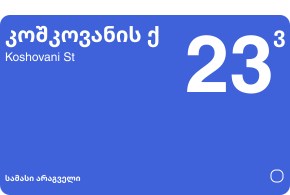

# Tbilisi Street Sign Generator (Beta)

This project is a web-based tool for generating SVG images of street signs as seen in Tbilisi, Georgia. It's currently in a beta stage, with a focus on functionality. A more user-friendly interface and design will be developed in the future.

## Features

- Customizable street name, house number, and district name in both English and Georgian script
- Optional QR code frame
- SVG output ready for download and use in graphics software

## How to Use

1. Enter the house number, street name in Georgian and English, district/metro name, and optionally a building letter.
2. Check the 'Show QR code frame' checkbox if you want a QR code frame to be part of the sign.
3. Click the 'Generate Sign' button to create the SVG image.
4. If you are satisfied with the result, click the 'Download SVG' button to download the SVG file.

## Technology Stack

This project is built using HTML, CSS, and JavaScript. 

## Future Improvements

- Addition of an aesthetically pleasing and user-friendly interface
- More customization options for the signs

This is a self-contained project, so to get it running locally, just clone the repository and open `index.html` in your web browser.

Please note: This tool is in beta stage. Feedback and suggestions are welcome. Feel free to open an issue or submit a pull request.
